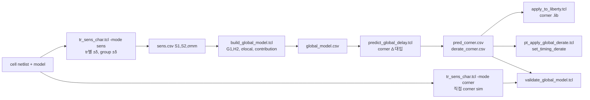

# LVF 감도 기반 Global Variation Delay 모사 방법론

Author: yoobeom.kim@samsung.com

## 1. 목적

LVF characterization은 arc의 table point마다 트랜지스터별 variation 시뮬레이션을 수행한다.
각 트랜지스터 $i$ 의 parameter $q$ (vth, u0 등)를 $\pm\delta$ 흔들어 delay 감도 $S_{iq}$ 를 얻고,
mismatch sigma와 결합해 `ocv_sigma_*` (또는 moment) table을 만든다.

이 감도는 local(mismatch) sigma 계산에만 쓰이고 버려진다.
같은 감도를 coherent하게 더하면 global variation(die-to-die vth0, u0 shift)에 대한 delay 변화가 나온다.
본 방법론은 이 성질을 이용해 추가 characterization 없이 다음을 만든다.

- 임의 global point(예: SSG, FFG, +2σ Vth_N)의 delay / transition table (Liberty)
- cell별 global derate 계수 (PrimeTime / Tempus `set_timing_derate`)
- 트랜지스터별 global 기여도 (어느 device가 corner shift를 만드는지)

적용 대상: 이미 LVF flow가 있는 라이브러리에서 corner what-if, PDK model update 영향 평가,
corner 간 보간, LVF sigma의 local/global 정합성 검토.

## 2. 이론

### 2.1 표기

| 기호 | 의미 |
|---|---|
| $D$ | arc 한 table point의 delay 또는 output transition (측정값 $v$) |
| $i$ | cell 내 트랜지스터 instance (M1, M2, ...) |
| $g$ | global variation group (N, P, 또는 Vt flavor별 N_lvt, P_lvt ...) |
| $q$ | parameter (vth: $\|V_{th}\|$ shift [V], u0: 상대 shift) |
| $S1_{iq}$ | $\partial D/\partial q_i$ , central difference $(D_+ - D_-)/2\delta$ |
| $S2_{iq}$ | $\partial^2 D/\partial q_i^2$ , $(D_+ - 2D_0 + D_-)/\delta^2$ |
| $\sigma_{mm,iq}$ | 트랜지스터 $i$ 의 mismatch 1σ (PDK, Pelgrom $A/\sqrt{WL}$) |
| $\sigma_{g,gq}$ | global 1σ (PDK corner 정의) |
| $\Delta_{gq}$ | 평가하려는 global shift |

부호 규약: vth는 $|V_{th}|$ 증가(slow)가 양수, u0는 증가(fast)가 양수.
BSIM4 `delvto`는 signed `vth0`에 더해지므로 PMOS는 `cfg(shift_sign,P,vth) -1` 로 뒤집는다.
BSIM-CMG는 `delvtrand`, `u0mult`를 hook으로 쓴다.

### 2.2 Local과 global은 같은 감도의 다른 합

Local(mismatch)은 트랜지스터끼리 독립이므로 RSS:

$$\sigma_{local}^2 = \sum_i \sum_q \left(S1_{iq}\,\sigma_{mm,iq}\right)^2$$

Global은 같은 group의 모든 트랜지스터가 같은 방향으로 움직이므로 coherent sum:

$$\Delta D_{global} = \sum_{g,q}\left[ G1_{gq}\,\Delta_{gq} + \tfrac{1}{2} H2_{gq}\,\Delta_{gq}^2 \right],
\quad G1_{gq} = \sum_{i\in g} S1_{iq},\quad H2_{gq} = \sum_{i\in g} S2_{iq}$$

LVF sigma는 $\sqrt{\sum c^2}$, global shift는 $\sum S1$ 이므로 두 값의 비율은 cell topology에 따라 다르다.
같은 크기 트랜지스터 $n$ 개가 균등 기여하면 local은 $\sqrt{n}$, global은 $n$ 에 비례한다.
flat derate로 global을 흉내내면 이 차이를 놓친다.

### 2.3 기여도(contribution)와의 관계

트랜지스터 $i$ 의 sigma 기여 $c_{iq} = S1_{iq}\,\sigma_{mm,iq}$, LVF variance share $w_{iq} = c_{iq}^2/\sigma_{local}^2$.
tool이 부호 없는 share만 내보낼 때도 1차 global 감도는 복원된다.

$$G1_{gq} = \sum_{i\in g} \mathrm{sign}_{iq}\,\sqrt{w_{iq}}\;\frac{\sigma_{local}}{\sigma_{mm,iq}}$$

부호는 원 시뮬레이션 결과에서 가져오는 것이 원칙이다.
없으면 pull rule(N은 fall edge, P는 rise edge를 driving; vth는 driving edge에서 +, 반대 edge에서 −; u0는 반대)로 대체한다.
이 규칙은 non-driving group의 작은 음의 기여(contention, 누설)를 반대 부호로 잡을 수 있어 1차 모델의 오차 요인이 된다. 예제 수치는 5절 참조.

### 2.4 2차 항과 cross term

트랜지스터별 $\pm\delta$ 시뮬레이션은 대각 2차 항 $S2_{ii}$ 만 준다.
$\partial^2 D/\partial q_i \partial q_j$ (stack된 NMOS 두 개가 같이 느려질 때의 상호작용)는 개별 perturbation으로는 나오지 않는다.
group 전체를 $\pm\delta$ 흔드는 시뮬레이션 2회를 추가하면 (`cfg(group_sens) 1`, arc당 group×param×2 회)
cross term을 포함한 $H2^{direct}$ 를 얻는다. 1차 항은 두 방법이 일치해야 하며 이것이 감도 데이터의 정합성 검사가 된다.

### 2.5 모델 변형

Vth 대비 delay는 지수적 성격이 있어 log 영역에서 전개하면 큰 shift에서 오차가 작다.
$x = G1/D_0$, $y = H2/D_0 - x^2$ 로 두면

| mode | $\Delta D$ |
|---|---|
| lin | $\sum G1\,\Delta$ |
| quad | $\sum \left(G1\,\Delta + \tfrac12 H2\,\Delta^2\right)$ |
| loglin | $D_0\left(\exp\sum x\Delta - 1\right)$ |
| logquad | $D_0\left(\exp\sum\left(x\Delta + \tfrac12 y\Delta^2\right) - 1\right)$ |

log 계열은 group/parameter 간 결합이 곱 형태다 (Vth와 u0가 동시에 움직이는 SSG에서 유리).
어느 것을 쓸지는 5절의 검증 결과로 정한다. 기본값은 logquad.

## 3. Flow



| 단계 | 스크립트 | 입력 | 출력 |
|---|---|---|---|
| 1 | `tr_sens_char.tcl -mode sens` | cfg, netlist, model | `sens.csv`, `nominal.csv`, `devices.csv` |
| 2 | `build_global_model.tcl` | `sens.csv` | `global_model.csv`, `local_sigma.csv`, `contrib.csv` |
| 3 | `predict_global_delay.tcl` | `global_model.csv`, corner 정의 | `pred_<c>.csv`, `derate_<c>.csv`, `derate_<c>_arcs.csv` |
| 4 | `apply_to_liberty.tcl` | nominal .lib, `pred_<c>.csv` | corner .lib |
| 4' | `pt_apply_global_derate.tcl` | `derate_<c>.csv` | PT/Tempus derate |
| 5 | `tr_sens_char.tcl -mode corner` + `validate_global_model.tcl` | corner 정의 | `corner_<c>.csv`, `validate_<c>.txt` |
| 대안 | `contrib_to_global.tcl` | tool의 contribution export | `global_model.csv` (1차 항) |

시뮬레이션 수 (arc, table 전체를 deck 하나에 포함): 트랜지스터 $n$ 개, parameter 2개 기준 $4n+1$ 회, group check 포함 시 $+8$ 회.
LVF flow가 이미 같은 perturbation을 돌리고 있으면 추가 비용은 0이다.

### 3.1 명령

```sh
cd example
tclsh ../scripts/tr_sens_char.tcl      -cfg config/example.cfg.tcl -mode sens -jobs 4
tclsh ../scripts/build_global_model.tcl -cfg config/example.cfg.tcl -sens out/sens.csv -o out
tclsh ../scripts/predict_global_delay.tcl -cfg config/example.cfg.tcl -model out/global_model.csv \
      -corner config/corners.tcl -name SSG -mode logquad -o out
tclsh ../scripts/apply_to_liberty.tcl  -cfg config/example.cfg.tcl -lib lib/example_nominal.lib \
      -pred out/pred_SSG.csv -o lib/example_SSG.lib -suffix _SSG
# 검증
tclsh ../scripts/tr_sens_char.tcl -cfg config/example.cfg.tcl -mode corner -corner config/corners.tcl
tclsh ../scripts/validate_global_model.tcl -pred out/pred_SSG.csv -sim out/corner_SSG.csv
```

`sh run_example.sh 4` 가 위 전체를 순서대로 실행한다 (ngspice 필요).

PrimeTime / Tempus:

```tcl
source pt_apply_global_derate.tcl
lvfgv_apply_global_derate -csv derate_SSG.csv -stat bound      ;# late=r_max, early=r_min
lvfgv_apply_global_derate -csv derate_SSG.csv -stat mean       ;# 양쪽 모두 r_mean
```

### 3.2 corner 정의

```tcl
# {group param unit value}   unit: abs | sigma (cfg(sigma_g,<group>,<param>) 배수)
set corner(SSG) {{N vth sigma 3} {P vth sigma 3} {N u0 sigma -3} {P u0 sigma -3}}
set corner(VTN_p30mV) {{N vth abs 0.030}}
```

`predict_global_delay.tcl -shift {N vth abs 0.03 P vth abs 0.03} -name X` 로 파일 없이 지정할 수도 있다.

## 4. 데이터 인터페이스

### 4.1 sens.csv (단계 1 출력, tool export 변환 시 이 형식으로)

| column | 내용 |
|---|---|
| cell, arc, meas | meas = delay \| trans |
| slew_idx, load_idx, slew, load | table point, SI 단위 (s, F) |
| inst, group, param | 트랜지스터 instance, group(N/P), parameter(vth/u0) |
| delta | perturbation 크기 (vth [V], u0 상대) |
| sigma_mm | 해당 instance/param의 mismatch 1σ (없으면 빈 칸) |
| v0, vplus, vminus | nominal, $+\delta$, $-\delta$ 측정값 |
| s1, s2 | central difference 1차, 2차 감도 |

group 전체 perturbation 행은 `inst = GROUP:N` 형식이며 `g1_direct`, `h2_direct` 로 넘어간다.

### 4.2 global_model.csv

`cell,arc,meas,slew_idx,load_idx,slew,load,v0,group,param,ntr,g1,h2,g1_direct,h2_direct`

### 4.3 pred_<corner>.csv / derate_<corner>.csv

pred: 네 가지 변형의 $\Delta v$ 와 선택 mode의 `v_pred`, `dv_rel_pred`.
derate: cell별 delay ratio $v_{pred}/v_0$ 의 mean / min / max (delay arc, 전 table point).

### 4.4 Liberty 적용 규칙

- arc ↔ timing() 매칭: `pin = out`, `related_pin = in`, `when` 문자열(공백 제거 후 비교), `timing_type` 없거나 combinational*
- out_dir rise → `cell_rise`, `rise_transition`; fall → `cell_fall`, `fall_transition`
- 값 갱신: $v_{new} = v_{old}(1 + r)$, $r$ 은 모델 grid의 `dv_rel_pred` 를 lib index 위에 bilinear 보간 (범위 밖은 clamp)
- template의 `variable_1/2` 순서(slew×load, load×slew) 모두 지원, 단위는 `time_unit`, `capacitive_load_unit` 에서 읽음
- `-scale_sigma` 옵션: 같은 arc의 `ocv_sigma_*`, `ocv_std_dev_*`, `ocv_mean_shift_*` 도 $(1+r)$ 배 (1차 근사)
- prediction에 없는 cell / table은 그대로 복사, library 이름에 `-suffix` 추가

상대값 $r$ 을 쓰므로 characterization tool의 nominal 값과 이 flow의 시뮬레이터 설정이 조금 달라도 table 자체는 tool 값이 유지된다.

## 5. 검증 (예제)

조건: ngspice 42, BSIM4 level 54 45nm급 example model (`example/models`), VDD 1.0 V, 25 °C,
INV_X1 / NAND2_X1 / NOR2_X1, slew {10, 30, 80} ps × load {1, 4, 12} fF, delay 50 %, transition 20–80 %.
$\delta_{vth}$ = 10 mV, $\delta_{u0}$ = 2 %. global 1σ 가정: vth 15 mV, u0 3 %.
비교 기준은 같은 deck에서 group 전체를 corner 값으로 직접 흔든 시뮬레이션.

### 5.1 감도 정합성 (1차 항 coherent sum vs group 직접 perturbation)

1차 항의 coherent sum $\sum_i S1_i$ 와 group 전체 perturbation $S1^{group}$ 의 차이 $d_1$,
cross term 크기 $d_2 = \tfrac12 (H2^{group} - \sum_i S2_i)(3\sigma_g)^2 / D_0$. 단위는 3σ shift에서 nominal delay 대비 %.

| cell | group/param | d1 mean | d1 max | d2 mean | d2 max |
|---|---|---|---|---|---|
| INV_X1 | N/vth, N/u0, P/vth, P/u0 | 0.000 | 0.000 | 0.000 | 0.000 |
| NAND2_X1 | N/vth | 0.000 | 0.007 | 0.039 | 0.158 |
| NAND2_X1 | N/u0 | 0.000 | 0.002 | 0.004 | 0.014 |
| NAND2_X1 | P/vth | 0.000 | 0.000 | 0.000 | 0.001 |
| NAND2_X1 | P/u0 | 0.000 | 0.000 | 0.000 | 0.001 |
| NOR2_X1 | N/vth | 0.000 | 0.000 | 0.000 | 0.001 |
| NOR2_X1 | N/u0 | 0.000 | 0.000 | 0.000 | 0.000 |
| NOR2_X1 | P/vth | 0.003 | 0.073 | 0.080 | 0.378 |
| NOR2_X1 | P/u0 | 0.000 | 0.001 | 0.013 | 0.067 |

1차 항은 두 방법이 일치한다 (max 0.07 %). cross term은 stack이 있는 group(NAND2 NMOS, NOR2 PMOS)에서만 보이고 3σ에서 0.4 % 이하다.

### 5.2 corner 예측 오차

delay row 90 point(3 cell × 10 arc × 9 point) 기준. e = |v_model − v_sim| / v_sim [%], mean / max.
es = shift 자체의 오차 |Δv_model − Δv_sim| / |Δv_sim| [%] 의 평균 (logquad).

| corner | 평균 shift [%] | lin | quad | loglin | logquad | es (logquad) |
|---|---|---|---|---|---|---|
| NVT_p1s (N vth +1σ) | +2.1 | 0.04 / 0.15 | 0.00 / 0.02 | 0.03 / 0.18 | 0.00 / 0.02 | 0.4 |
| NVT_p3s (N vth +3σ) | +6.5 | 0.40 / 1.31 | 0.05 / 0.26 | 0.26 / 1.46 | 0.04 / 0.27 | 2.6 |
| NVT_m3s (N vth −3σ) | −5.7 | 0.42 / 1.38 | 0.03 / 0.27 | 0.27 / 1.94 | 0.03 / 0.25 | 1.5 |
| PVT_p3s (P vth +3σ) | +7.3 | 0.57 / 1.73 | 0.09 / 0.48 | 0.26 / 1.00 | 0.06 / 0.41 | 9.4 |
| PVT_m3s (P vth −3σ) | −6.1 | 0.61 / 1.95 | 0.07 / 0.83 | 0.26 / 1.17 | 0.06 / 0.79 | 3.6 |
| NU0_m3s (N u0 −3σ) | +1.5 | 0.13 / 0.35 | 0.01 / 0.04 | 0.11 / 0.29 | 0.01 / 0.03 | 1.2 |
| PU0_m3s (P u0 −3σ) | +3.1 | 0.26 / 0.69 | 0.03 / 0.13 | 0.18 / 0.42 | 0.02 / 0.14 | 1.4 |
| SS1 (모두 1σ) | +5.9 | 0.22 / 0.41 | 0.09 / 0.20 | 0.09 / 0.20 | 0.03 / 0.15 | 0.5 |
| SSG (모두 3σ) | +19.3 | 1.91 / 3.47 | 0.85 / 1.89 | 0.82 / 1.48 | 0.29 / 0.82 | 1.8 |
| FFG (모두 3σ) | −15.1 | 2.18 / 4.23 | 0.68 / 1.74 | 0.71 / 1.80 | 0.25 / 1.04 | 1.4 |
| SFG | +4.0 | 1.82 / 3.45 | 0.67 / 1.70 | 0.85 / 2.57 | 0.30 / 1.42 | 1.6 |
| FSG | −0.2 | 1.93 / 4.19 | 0.66 / 1.40 | 0.83 / 2.29 | 0.30 / 1.65 | 1.7 |

PVT_p3s의 es 9.4 %는 PMOS Vth가 거의 영향을 주지 않는 fall arc(shift 자체가 0.1 ps 수준)에서 상대 오차가 커진 것이고 값 오차는 0.41 % 이하다.
전체 결과는 `example/out/validation_summary.txt`, point별 값은 `example/out/validate_<corner>.csv`.

### 5.3 기여도(부호 없음)에서 복원한 1차 항

부호를 버린 contribution share와 pull rule 부호만으로 복원한 1차 항의 오차. 3σ shift, nominal delay 대비 %.

| group/param | mean | max |
|---|---|---|
| N/vth | 0.104 | 1.018 |
| N/u0 | 0.042 | 0.330 |
| P/vth | 0.077 | 0.612 |
| P/u0 | 0.109 | 0.635 |

driving group(fall arc의 NMOS, rise arc의 PMOS)은 정확히 복원되고, 오차는 전부 non-driving group의 작은 음의 감도를 pull rule이 양수로 잡는 데서 온다.

### 5.4 판단

- 트랜지스터별 감도의 coherent sum은 group 직접 perturbation과 일치한다. LVF용 감도 데이터를 그대로 global 모사에 쓸 수 있다.
- 2차 항까지 트랜지스터별 데이터만으로 충분하다. cross term은 이 예제의 2-stack에서 0.4 % 이하이며, 더 깊은 stack이나 multi-stage cell은 `group_sens` 8회 시뮬레이션으로 확인한다.
- 기본 mode는 logquad. ±3σ 복합 corner(shift ±15~19 %)에서 값 오차 mean 0.3 %, max 1.7 %. lin은 mean 2 %, max 4 %로 ±1σ 범위에서만 쓴다.
- contribution share만 있을 때는 1차 항만 복원되며 3σ에서 1 % 이내 오차가 non-driving group 부호에서 생긴다. 부호 있는 감도 export가 가능하면 그것을 쓴다.
- 적용 기준 예: 값 오차 max 2 % 이내인 cell은 모델 lib 사용, 초과 arc는 직접 characterization. 기준은 signoff margin에 맞춰 정한다.

## 6. Characterization tool 연계

1. tool이 instance별 감도(또는 $\pm\delta$ 측정값)를 export하면 4.1 형식으로 변환해 단계 2부터 사용한다.
   단위는 hook parameter 기준(vth [V], u0 상대)으로 맞춘다.
2. export가 없으면 `tr_sens_char.tcl` 로 같은 netlist / model / 측정 조건에서 감도를 뽑는다.
   HSPICE: `cfg(sim_cmd) {hspice -i %DECK% -o %BASE%}`, `cfg(result_format) mt0`, `cfg(result_file) %BASE%.mt0`.
   Spectre는 `.measure` 결과 파일을 `keyval` 형식으로 읽는다.
3. contribution share만 있으면 `contrib_to_global.tcl` (1차 항, lin / loglin 만 가능).
4. PDK macro subckt(`X` instance)인 경우 hook을 macro가 전달하는 instance parameter로 바꾼다.
   `cfg(hook,vth) {dvth_mm=%s}` 처럼 PDK가 제공하는 이름을 쓰고 `cfg(group_map)` 을 macro 이름 regex로 잡는다.
   Vt flavor별로 global shift가 다르면 group을 `N_svt`, `N_lvt` 처럼 나눈다.
5. global parameter가 mismatch hook과 다른 물리량으로 정의된 PDK(예: global은 `vth0`, mismatch는 `toxe`)에서는
   hook을 global 정의와 같은 물리량으로 잡아야 한다. 감도는 hook parameter에 대한 것이기 때문이다.

## 7. 한계

- 감도는 추출 조건(VDD, 온도, nominal process)에 종속된다. 다른 PVT의 global 모사는 그 조건에서 다시 추출한다.
- 예제 오차는 ±3σ 단일 / 복합 corner 기준이다. near-threshold VDD나 3σ 초과 shift는 별도 검증 없이 쓰지 않는다.
- constraint arc(setup / hold), min pulse width, leakage는 다루지 않는다. 같은 구조로 확장 가능하나 측정 정의가 다르다.
- `-scale_sigma` 는 corner에서의 LVF sigma 변화를 1차로 근사한 것이다. 정확한 corner sigma는 corner에서의 감도 재추출이 필요하다.
- interpolation은 relative shift에 대해 bilinear, lib grid가 모델 grid 밖이면 edge 값을 쓴다. 모델 grid는 lib grid를 덮도록 잡는다.
- multi-stage cell(buffer, AOI 등)에서 cross term은 stage 간 slew 결합으로 커질 수 있다. `group_sens` 로 확인한다.

## 8. 파일 구성

```
lvf_global_var/
  README.md
  scripts/
    lvfgv_common.tcl            공통 (config, CSV, netlist, deck, sim, measure, corner)
    tr_sens_char.tcl            감도 / corner 시뮬레이션 driver
    build_global_model.tcl      G1, H2, σ_local, contribution
    predict_global_delay.tcl    corner 평가, derate
    apply_to_liberty.tcl        Liberty table patch
    pt_apply_global_derate.tcl  PrimeTime / Tempus derate 적용
    validate_global_model.tcl   직접 시뮬레이션 대비 오차
    summarize_validation.tcl    corner별 오차 요약
    contrib_to_global.tcl       contribution → 1차 global 모델
    write_nominal_lib.tcl       예제용 nominal Liberty (LVF sigma 포함)
  doc/patent/
    patent_draft_ko.md          특허 출원 명세서 초안 (KIPO 형식), patent_draft_ko.docx / .pdf
    prior_art_review_ko.md      선행기술 검토서, prior_art_review_ko.docx / .pdf
    make_figures.py, make_docx.js  도면 PNG 생성, docx 생성
    make_figures_pptx.py        도면을 편집 가능한 PowerPoint 도형·표·차트로 생성
    patent_figures.pptx         도 1 ~ 도 12 (슬라이드당 1도, 편집용)
    figures/fig1..fig12.png     도면 (docx 삽입용)
  example/
    config/example.cfg.tcl      설정
    config/corners.tcl          corner 정의
    models/bsim4_example.sp     BSIM4 example model (foundry model 아님)
    cells/std_cells.sp          INV / NAND2 / NOR2
    lib/                        생성된 Liberty
    out/                        결과 CSV, validation report
    run_example.sh              end-to-end
```
